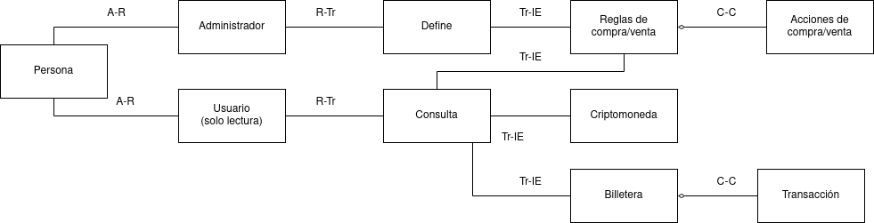
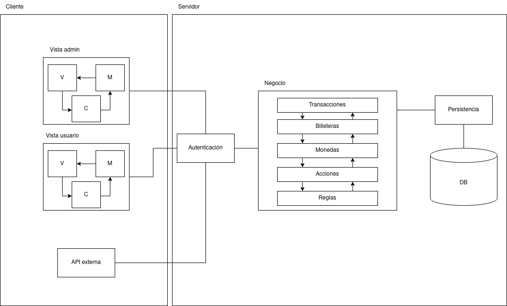

### Modelo de Dominio

### Arquitectura

Para el sistema propuesto, en el nivel más alto utilizaríamos una arquitectura EA (Enterprise Architecture), para separar la parte de los Clientes (admins, usuarios, APIs) del Servidor (lógica de billeteras, transacciones, reglas, etc).

Para separar la vista de cada tipo de usuario, aplicaríamos un patrón MVC para cada uno, de forma que cada uno pueda ver y manipular la información que le corresponde.

Dentro del nodo de negocio en la arquitectura EA, se puede aplicar un patrón de Layers para abstraer las distintas capas de la lógica de negocio, como lo son las Reglas y sus correspondientes Acciones, la Billetera de un usuario, las Transacciones que la componen, etc.